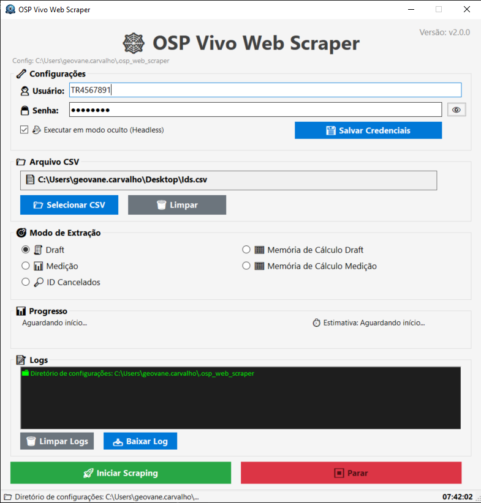

# 🕸️ OSP Vivo Web Scraper

[](https://github.com/geovanecarvalho/OspWebScraper-winforms/releases/tag/v2.1.0)
[](https://dotnet.microsoft.com/)
[](https://github.com/geovanecarvalho/OspWebScraper-winforms?tab=License-1-ov-file)

Ferramenta desktop para extração automatizada de dados do sistema OSP Control da Vivo.

## 📋 Índice

- [Sobre o Projeto](#-sobre-o-projeto)
- [Funcionalidades](#-funcionalidades)
- [Tecnologias Utilizadas](#️-tecnologias-utilizadas)
- [Pré-requisitos](#-pré-requisitos)
- [Instalação](#-instalação)
- [Informações](#-informações)
- [Aviso de Confidencialidade](#️-aviso-de-confidencialidade)
- [Meus contatos](#-meus-contatos)

## 🚀 Sobre o Projeto

O **OSP Vivo Web Scraper** é uma aplicação Windows Forms desenvolvida em C# que automatiza a extração de dados do sistema OSP Control da Vivo. A ferramenta utiliza o Playwright para navegação web e oferece múltiplos modos de extração, atendendo diferentes necessidades de coleta de dados.

## ✨ Funcionalidades

- 🔐 **Login automático** com salvamento de sessão
- 📁 **Leitura de CSV** com IDs para processamento
- 🎯 **5 modos de extração** diferentes
- 📊 **Barra de progresso** em tempo real
- ⏱️ **Estimativa de tempo** restante
- 💾 **Salvamento parcial** ao interromper processo
- 📝 **Logs detalhados** com cores e emojis
- 🕐 **Relógio na status bar**
- 🎨 **Interface amigável** e intuitiva
- 📄 **Exportação para Excel** (formato .xlsx)

## 🛠️ Tecnologias Utilizadas

| Tecnologia | Versão | Finalidade |
|------------|--------|------------|
| .NET | 8.0 | Framework principal |
| Windows Forms | 8.0 | Interface gráfica |
| Playwright | 1.40+ | Automação web |
| ClosedXML | 0.102+ | Geração de Excel |
| CsvHelper | 32.0+ | Leitura de CSV |

## 📋 Pré-requisitos

- Windows 10 ou superior
- [.NET 8.0 SDK](https://dotnet.microsoft.com/download)
- [Google Chrome](https://www.google.com/chrome/) instalado
- Acesso à rede da Vivo (para acessar o OSP Control)

## 🔧 Instalação

### 1. Clone o repositório

```bash
git clone https://github.com/geovanecarvalho/OspWebScraper-winforms.git
cd OSPWebScraper
```
### 2. Como rodar o projeto
```
dotnet build
dotnet run
```
## 📸 Interface do Sistema

*Interface principal da aplicação*

✨ Interface intuitiva desenvolvida para que qualquer usuário possa realizar extrações de forma simples e rápida.
Desenvolvida pensando na melhor experiência para o usuário final.



<div align="center">
  <!-- Logo da Vivo -->
  
  
  # 🕸️ OSP Vivo Web Scraper
  
  *Ferramenta interna - uso exclusivo Telemont*
</div>

---

## 📋 Informações

| | |
|---|---|
| **Empresa** | Telemont (Engenharia e Telecomunicações) |
| **Departamento** | (Projeto de telecomunicação) |
| **Desenvolvedor** | Geovane Carvalho |
| **Versão** | 2.0.0 |
| **Última atualização** | Maio/2026 |

---

## ⚠️ Aviso de Confidencialidade

Esta ferramenta foi desenvolvida exclusivamente para **Telemont**. 

## 👨‍💻 Meus contatos

**Geovane Carvalho**
- GitHub: [@geovanecarvalho](https://github.com/geovanecarvalho)
- Email: geovanehacker.io@gmail.com
- LinkedIn: [Geovane Carvalho](https://www.linkedin.com/in/geovane-oliveira-de-carvalho-b15157122)